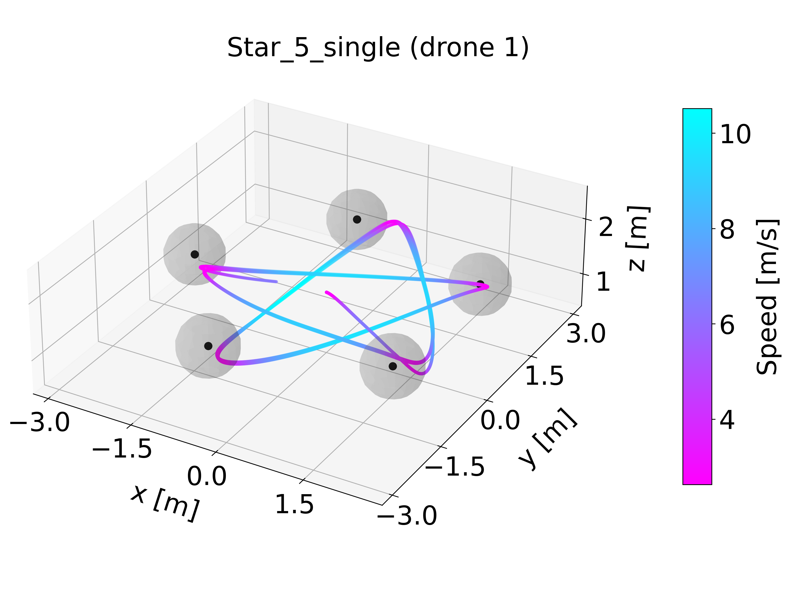
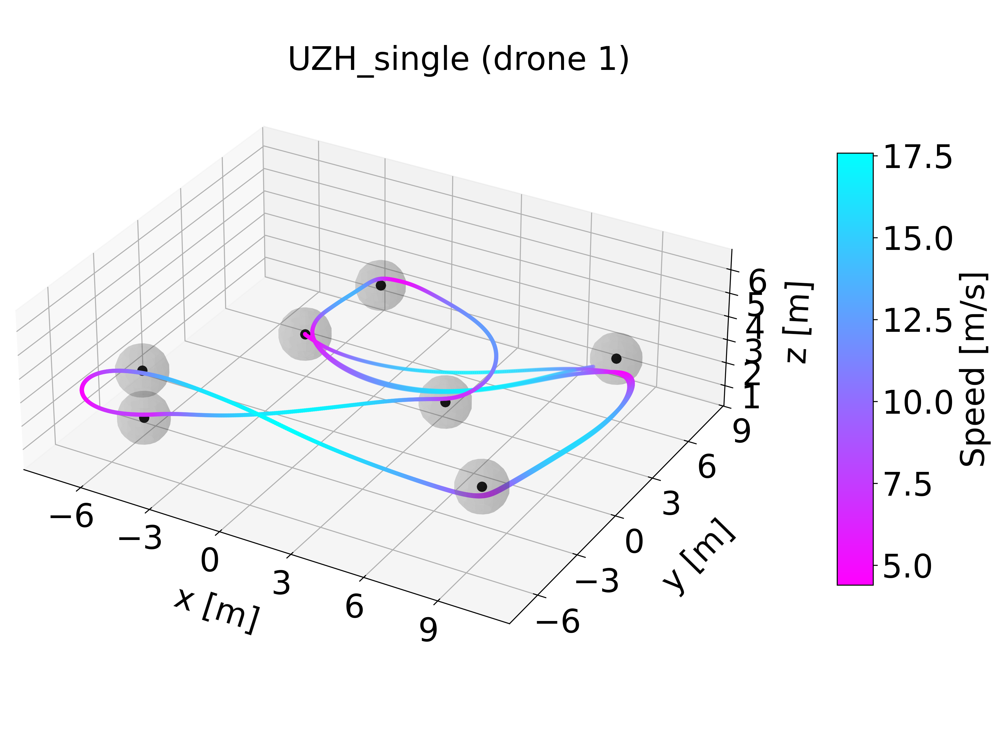

# RaceUtils

|  |  |
| :---------- | :---------- |
| <video src="https://github.com/user-attachments/assets/1e0c0307-f4e2-4cb0-b6dc-8d42821d5b49" /> | <video src="https://github.com/user-attachments/assets/3401105a-a257-4f92-b0de-3624a7d1632f" /> |

**RaceUtils** is a Python package that provides tools for creating, manipulating, and visualizing drone race tracks. Whether you need predefined professional tracks, randomly generated courses, or custom trajectories, this library offers a comprehensive solution for drone racing simulation and training environments. If you want to learn more, refer to [Tools](#tools).

## Table of Contents

1. [Installations](#installations)
2. [Examples](#examples)
3. [Visualizations](#visualizations)
   - [3.1 Trajectories](#1-trajectories)
   - [3.2 Trajectories with tubes](#2-trajectories-with-tubes)
   - [3.3 Animations](#3-animations)
4. [Tools](#tools)

## Installations

For the latest development version or to contribute:

```bash
# Clone the repository
git clone https://github.com/KafuuChikai/RaceUtils.git
cd RaceUtils

# Install in development mode
pip install -e .
```

## Examples

Coming soon ...

## Visualizations

### 1. Trajectories

The random trajectory examples:

<table>
  <tr>
    <td style="width:50%;"></td>
    <td style="width:50%;"></td>
  </tr>
</table>

### 2. Trajectories with tubes

**Update**: Plot 3D trajectories and visulize with Tube.

<table>
  <tr>
    <td style="width:50%;"></td>
    <td style="width:50%;"></td>
  </tr>
</table>

<table>
  <tr>
    <td style="width:50%;"></td>
    <td style="width:50%;"></td>
  </tr>
</table>

### 3. Animations

|  |  |
| :---------- | :---------- |
|  | <video src="https://github.com/user-attachments/assets/3b0836a2-5f65-41a6-bb40-023390bcd4c4" /> |
|  | <video src="https://github.com/user-attachments/assets/e59134fe-9ab4-4757-a27d-81a9c0fb0b16" /> |

## Tools

1. [RaceGenerator](docs/utils_manual.md#L3)
2. RaceVisualizer
