# RaceUtils

<table>
  <tr>
    <td style="width:50%;">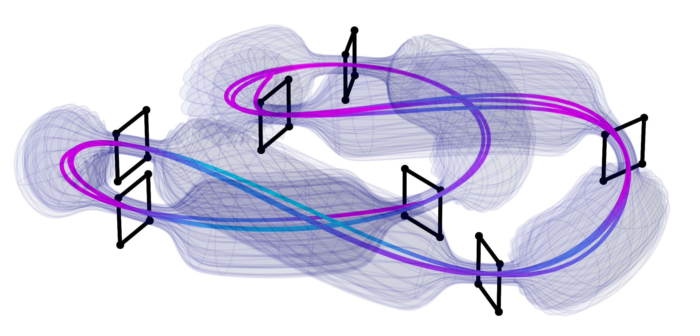</td>
    <td style="width:50%;">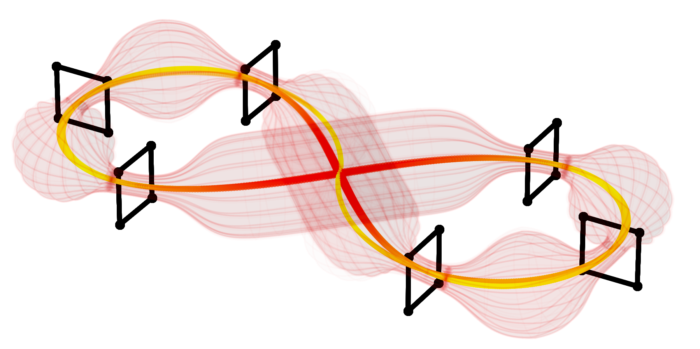</td>
  </tr>
</table>
With this package, you can generate random racetracks. If you want to learn more, refer to [Tools](#tools).

## Visualizations

### 1. Predefined trajectory

You can get a predefined trajectory below:

  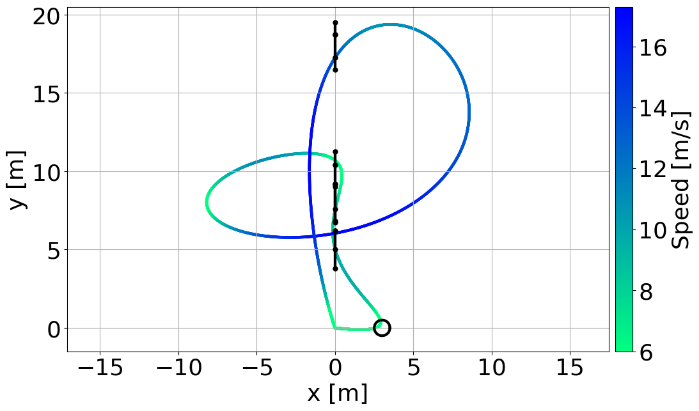

### 2. Random trajectories

The random trajectory examples:

<table>
  <tr>
    <td style="width:50%;">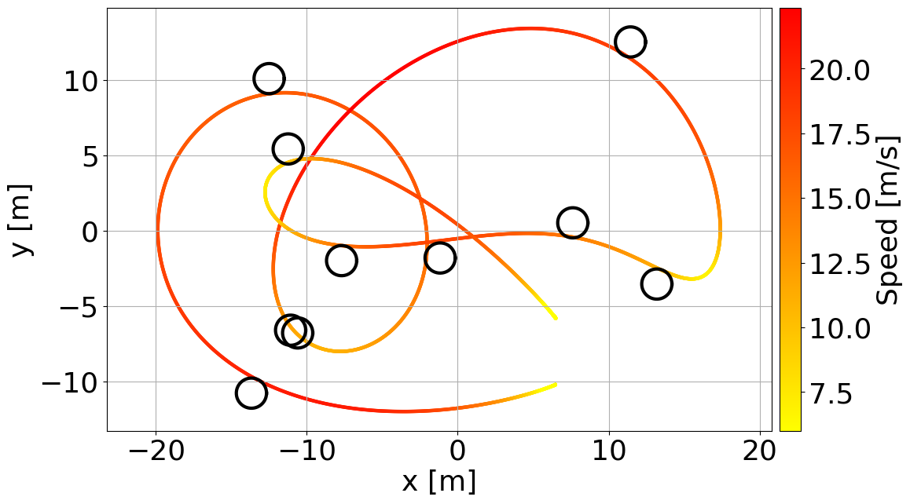</td>
    <td style="width:50%;">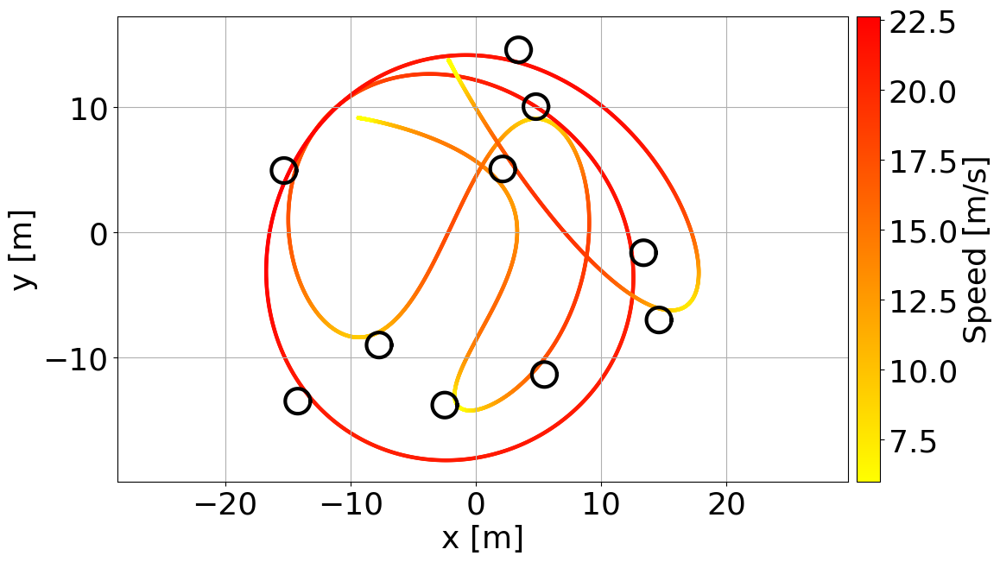</td>
  </tr>
</table>

<table>
  <tr>
    <td style="width:50%;">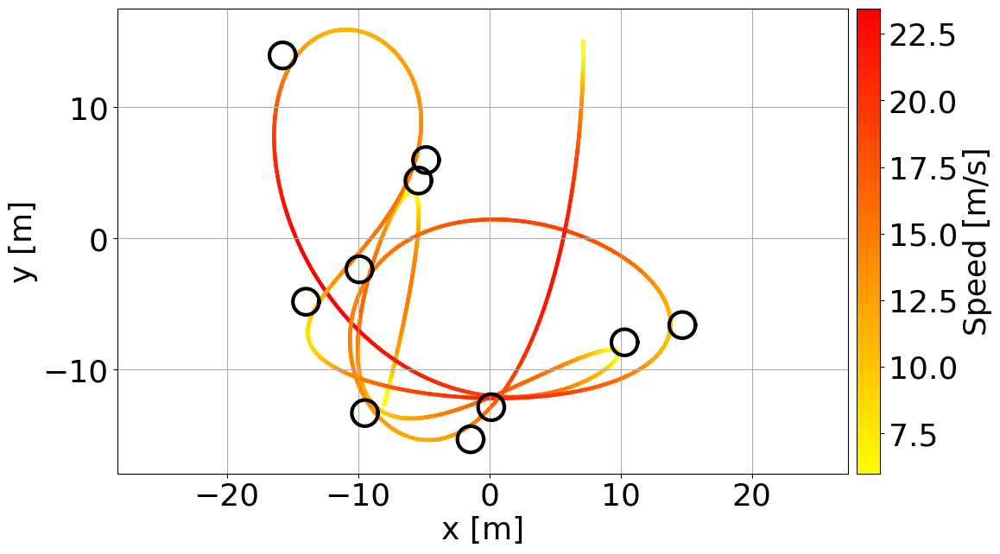</td>
    <td style="width:50%;">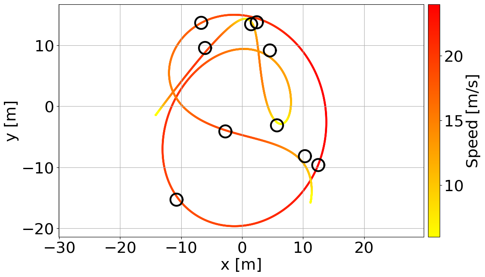</td>
  </tr>
</table>

<table>
  <tr>
    <td style="width:50%;">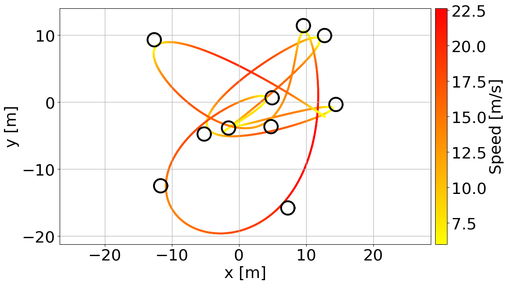</td>
    <td style="width:50%;">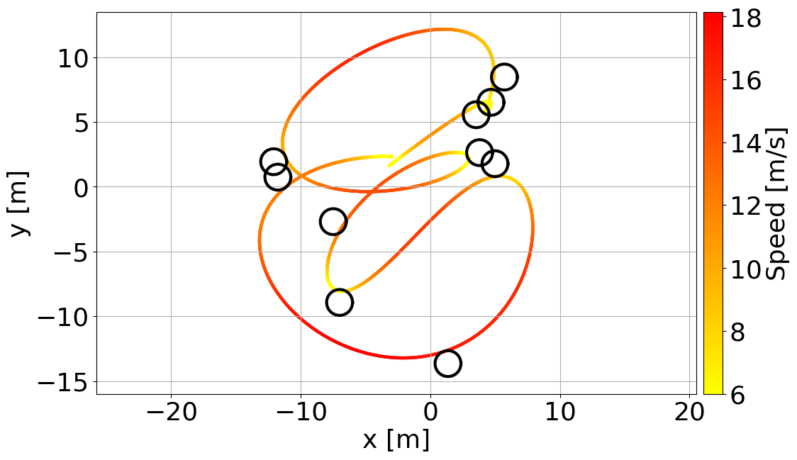</td>
  </tr>
</table>

### 3. 3D trajectories with Tube

**Update**: Plot 3D trajectories and visulize with Tube.

<table>
  <tr>
    <td style="width:50%;">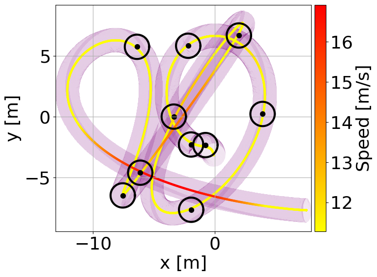</td>
    <td style="width:50%;">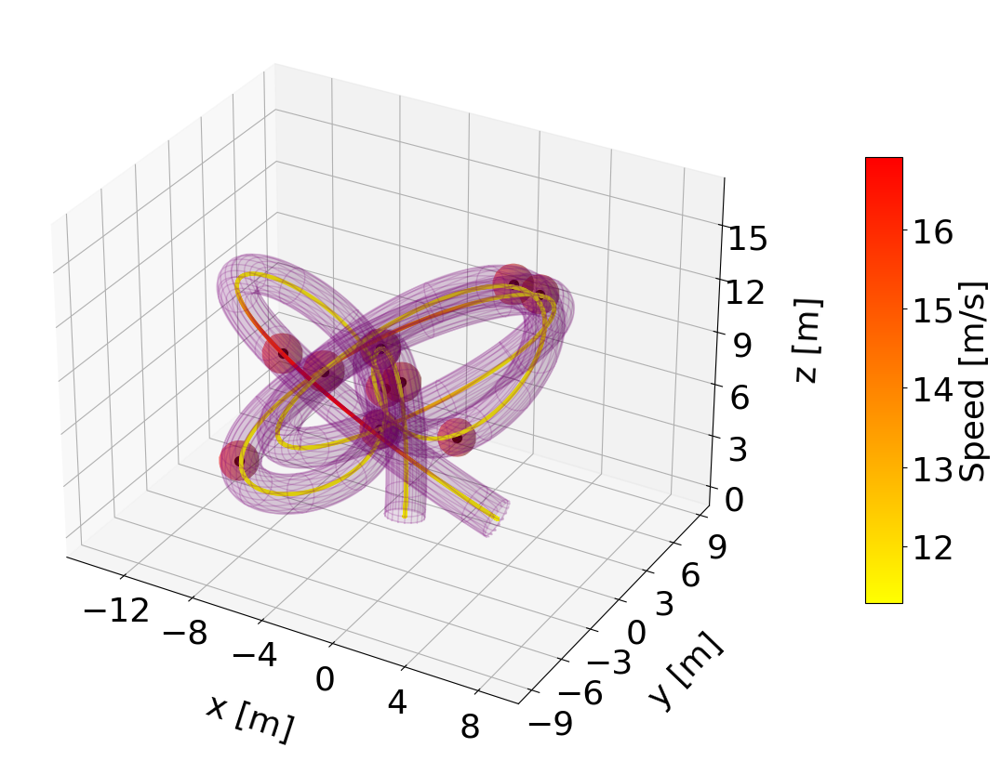</td>
  </tr>
</table>
<table>
  <tr>
    <td style="width:50%;">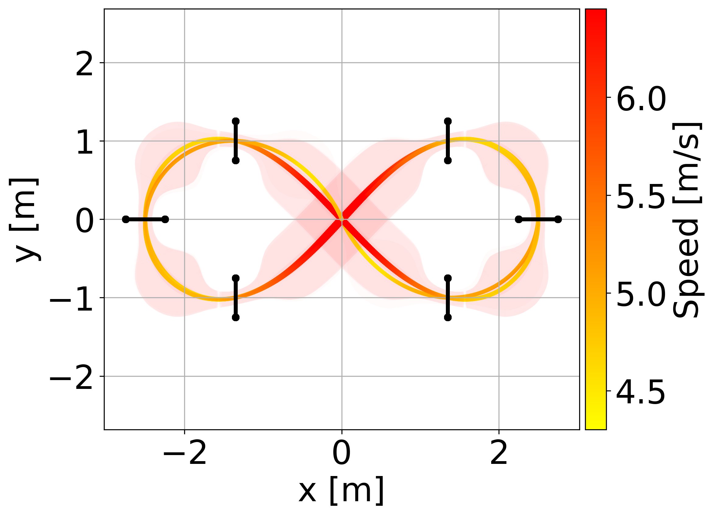</td>
    <td style="width:50%;">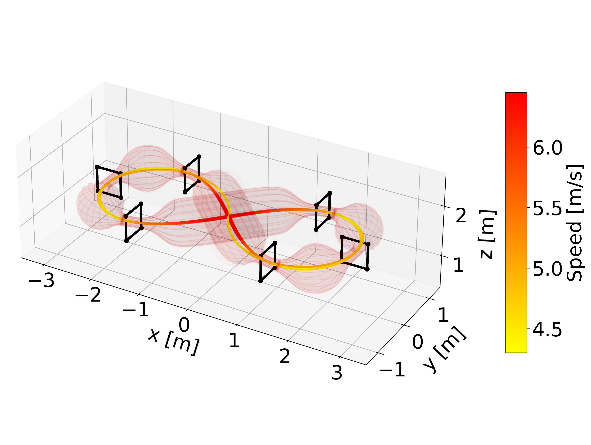</td>
  </tr>
</table>

<table>
  <tr>
    <td style="width:50%;">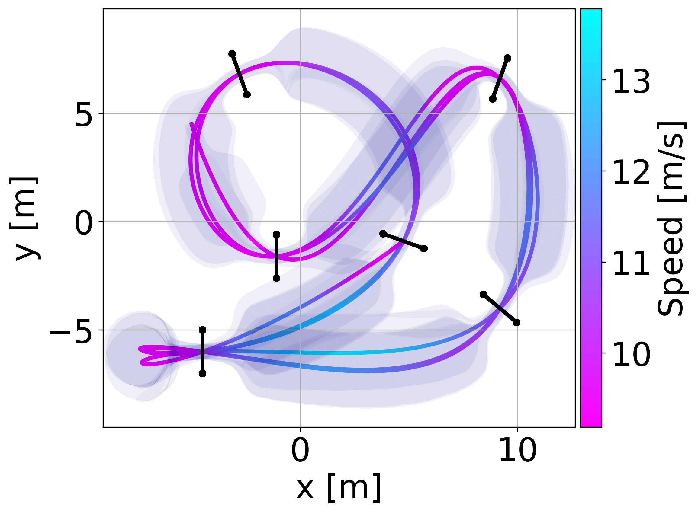</td>
    <td style="width:50%;">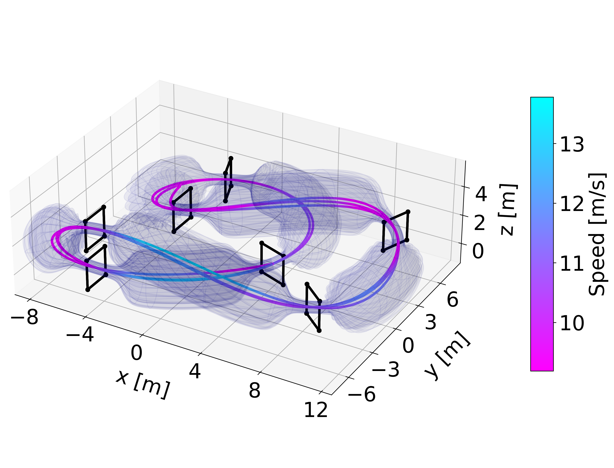</td>
  </tr>
</table>

## Tools

1. [RaceGenerator](docs/utils_manual.md#L3)
2. RaceVisualizer